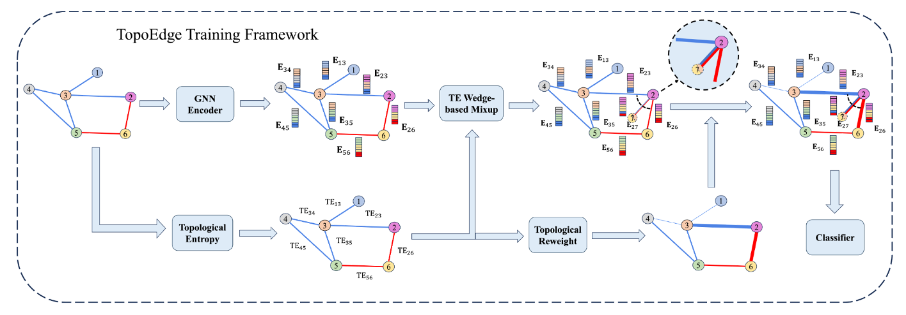

# Edge Classification on Graphs: New Directions in Topological Imbalance
[](https://github.com/XueqiC/TopoEdge) 
[](https://github.com/XueqiC/TopoEdge/blob/main/LICENSE)
 
[](https://doi.org/10.1145/3701551.3703518)

## Introduction
Code for WSDM 2025 paper [Edge Classification on Graphs: New Directions in Topological Imbalance](https://arxiv.org/abs/2406.11685). All the dataset is available for download at [this link](https://drive.google.com/drive/folders/18FEYhYIbsuh932zpRcRNFpPCSesQ2LpK?usp=drive_link).



This study pioneers a comprehensive approach to edge classification. We identify a novel **Topological Imbalance Issue**, which arises from the skewed distribution of edges across different classes, affecting the local subgraph of each edge and harming the performance of edge classifications.

To overcome this challenge, we introduce **Topological Entropy** (TE), a novel topological-based metric that measures the topological imbalance for each edge. Our empirical studies confirm that TE effectively measures local class distribution variance, and indicate that prioritizing edges with high TE values can help address the issue of topological imbalance. 

Inspired by this observation, we develop two strategies - Topological Reweighting and TE Wedge-based Mixup - to adaptively focus training on (synthetic) edges based on their TEs. While topological reweighting directly manipulates training edge weights according to TE, our wedge-based mixup interpolates synthetic edges between high TE wedges. To further enhance performance, we integrate these strategies into a novel topological imbalance strategy for edge classification: **TopoEdge**. 

## Run the code
Please check 'run_all.sh' to find out the hyperparameter combinations or run the code.

## License
MIT License

## Contact 
Please feel free to email me (xueqi.cheng [AT] vanderbilt.edu) for any questions about this work.

## Citation
```
@inproceedings{cheng2024edge,
  author    = {Cheng, Xueqi and Wang, Yu and Liu, Yunchao and Zhao, Yuying and Aggarwal, Charu C and Derr, Tyler},
  title     = {Edge Classification on Graphs: New Directions in Topological Imbalance},
  booktitle = {WSDM},
  year      = {2025}
}
```